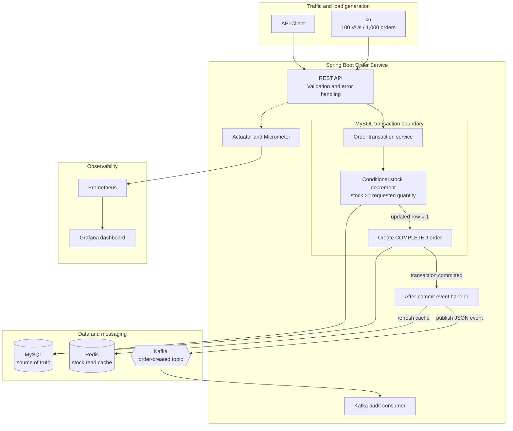

# Order System

以 Spring Boot 建置的商品訂單服務，示範高競爭情境下的庫存一致性、Redis cache，以及交易完成後的 Kafka 事件。

## 核心設計



庫存正確性由 MySQL 原子條件更新保證，不使用商品級分布式鎖將所有請求串行化。

```sql
UPDATE products
SET stock = stock - :quantity
WHERE product_id = :productId
  AND stock >= :quantity;
```

只有更新成功才會在同一個 transaction 建立訂單。Redis 是讀取 cache；Kafka consumer 只處理下游事件，不會再次修改庫存，因此訊息重送不會造成重複扣庫存。

## 技術

- Java 17、Spring Boot 3.4
- Spring Web、Validation、Data JPA
- MySQL 8、Flyway
- Redis
- Apache Kafka
- Actuator、Prometheus metrics
- JUnit 5、Mockito
- Docker Compose

## 啟動

需求：Docker 與 Docker Compose。

```bash
docker compose up -d --build
```

確認服務：

```bash
curl http://localhost:8080/actuator/health
```

停止服務：

```bash
docker compose down
```

若要同時移除本機資料庫 volume：

```bash
docker compose down -v
```

## API

### 建立商品

```bash
curl -i -X POST http://localhost:8080/api/products \
  -H 'Content-Type: application/json' \
  -d '{"name":"Keyboard","stock":100}'
```

### 查詢商品與 cache 庫存

```bash
curl http://localhost:8080/api/products/1
curl http://localhost:8080/api/products/1/stock
```

### 建立訂單

```bash
curl -i -X POST http://localhost:8080/api/orders \
  -H 'Content-Type: application/json' \
  -d '{"productId":1,"quantity":1}'
```

成功回傳 `201 Created`；商品不存在回傳 `404`；庫存不足回傳 `409`。所有錯誤都有一致的 JSON 格式。

### 查詢訂單

```bash
curl http://localhost:8080/api/orders/{orderId}
```

## 測試

```bash
./mvnw test
```

測試涵蓋：

- 訂單建立與查詢服務
- 原子扣庫存成功後建立訂單及發布事件
- 商品不存在與庫存不足
- 商品名稱 setter regression

## Prometheus 與 Grafana

啟動應用與監控 profile：

```bash
docker compose --profile observability up -d --build
```

| 服務 | 位址 |
|---|---|
| Spring Boot health | http://localhost:8080/actuator/health |
| Prometheus metrics | http://localhost:8080/actuator/prometheus |
| Prometheus | http://localhost:9091 |
| Grafana | http://localhost:3001（`admin` / `admin`） |

Grafana 會自動載入 `Order System Load Test` dashboard，包含：

- 訂單 API 每秒請求數與 HTTP status
- p95 latency
- 成功與拒絕訂單 business metrics
- JVM heap、CPU 與 Hikari connection pool


## k6 高併發測試

先啟動應用與監控，再執行一次性的 k6 profile：

```bash
docker compose --profile observability up -d --build
docker compose --profile loadtest run --rm k6
```

壓測設定為 100 VUs、共 1,000 筆訂單。k6 會自行建立庫存為 1,000 的商品，並驗證：

- 1,000 筆訂單全部回傳 `201`
- 所有訂單狀態都是 `COMPLETED`
- p95 小於 1 秒
- 壓測結束後商品庫存必須剛好為 0

腳本位於 `load-test/order-load.js`，測試期間可直接在 Grafana 觀察延遲、吞吐、JVM 與連線池變化。

## 設定

所有外部連線皆可透過環境變數覆寫：

| 變數 | 預設值 |
|---|---|
| `DB_URL` | `jdbc:mysql://localhost:3306/order_system...` |
| `DB_USERNAME` | `order_app` |
| `DB_PASSWORD` | `order_password` |
| `REDIS_HOST` | `localhost` |
| `REDIS_PORT` | `6379` |
| `KAFKA_BOOTSTRAP_SERVERS` | `localhost:9092` |

資料表由 Flyway migration 建立，JPA 使用 `ddl-auto=validate` 驗證 schema。

## 一致性邊界

MySQL 庫存與訂單建立具有原子性。Redis 和 Kafka 在 transaction commit 後更新，因此它們不會造成資料庫超賣。

目前 Kafka 發布屬於 best-effort after-commit event；若需求要求「資料庫成功後事件保證送達」，正式環境應加入 transactional outbox、重試與 dead-letter topic。這個限制不影響訂單及庫存的 MySQL 一致性。
