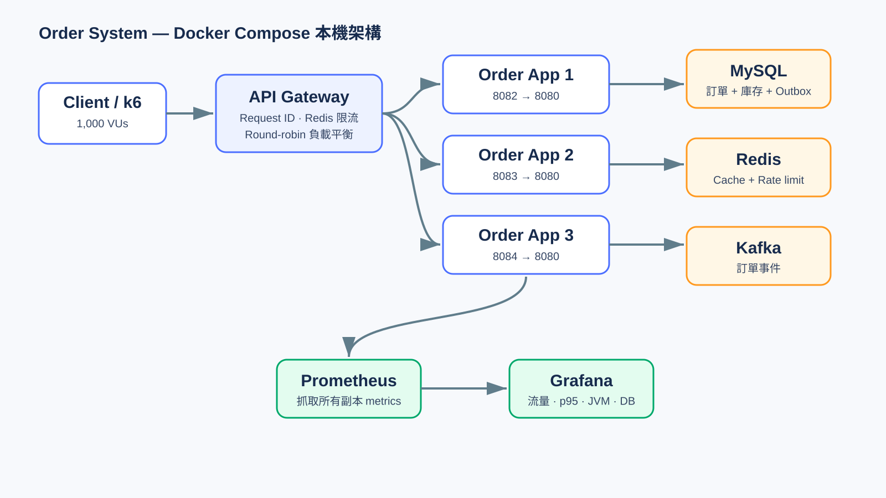
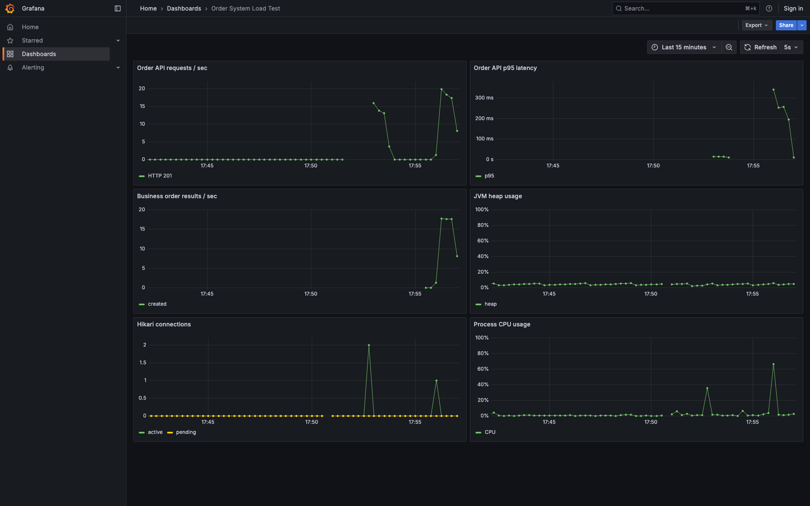
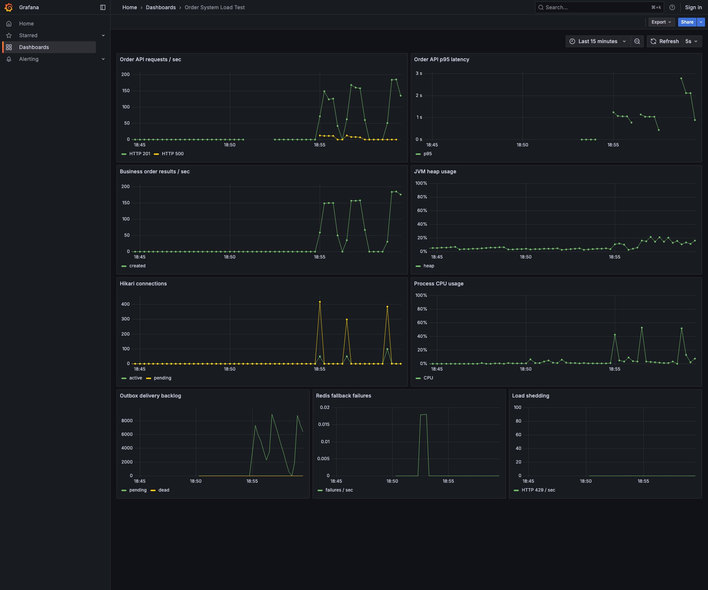
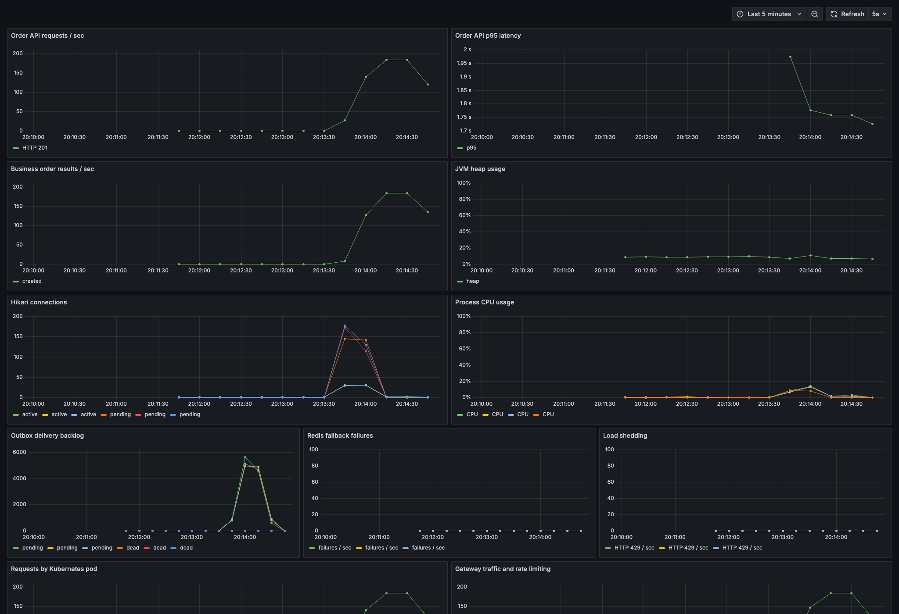
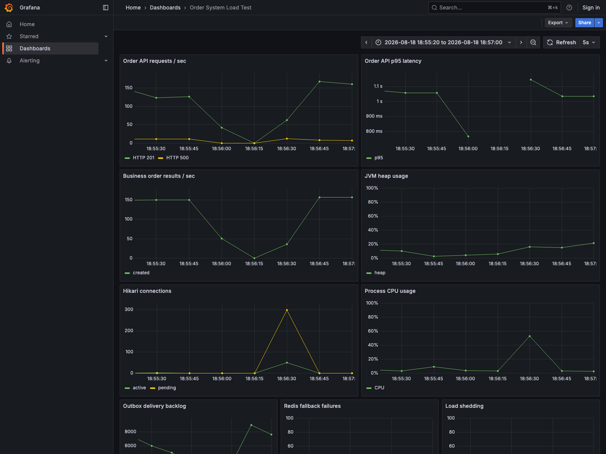
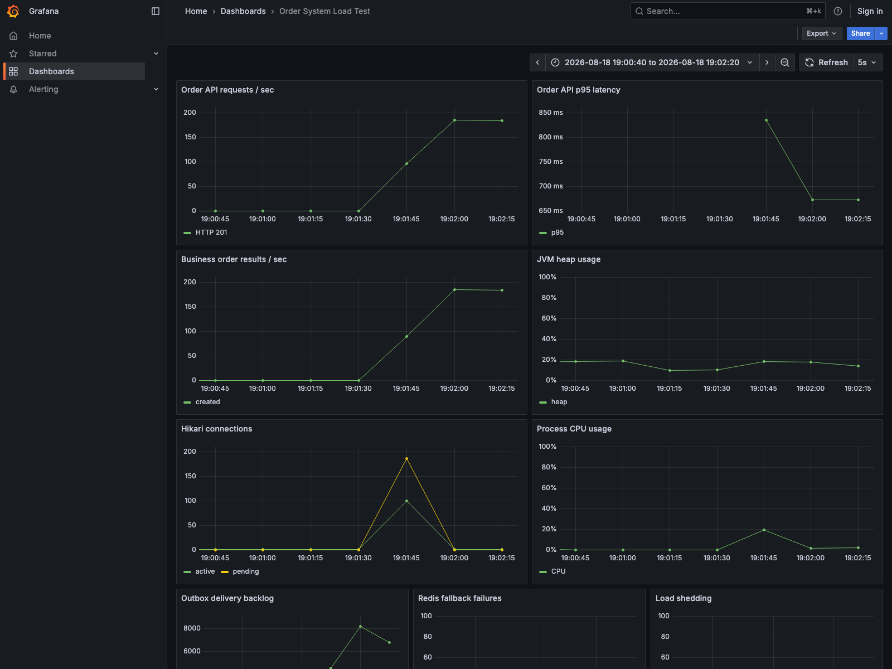
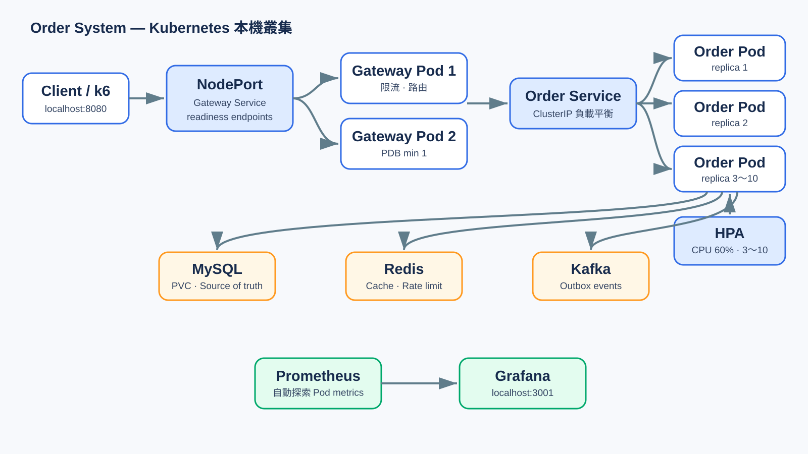

# Order System

以 Spring Boot 建置的商品訂單服務，示範高競爭庫存一致性、冪等下單、Redis 降級，以及透過 Transactional Outbox 保證 Kafka 事件最終送達。

## 核心設計



所有外部流量先進入 API Gateway。Gateway 負責 request ID、每個 client 的 Redis 限流與輪詢分流；三個 Order Service 副本共同使用 MySQL、Redis 與 Kafka。任一應用副本停止時，其餘副本仍可繼續服務。

庫存正確性由 MySQL 原子條件更新保證，不使用商品級分布式鎖將所有請求串行化。

```sql
UPDATE products
SET stock = stock - :quantity
WHERE product_id = :productId
  AND stock >= :quantity;
```

只有更新成功才會在同一個 transaction 建立訂單與 outbox event。Redis 是可失敗的讀取 cache；Kafka consumer 只處理冪等的下游工作，不會再次修改庫存，因此訊息重送不會重複扣庫存。

## 從原版到目前版本

| 原版問題 | 目前處理方式 |
|---|---|
| Producer 只送 `orderId`，consumer 卻期待 `orderId:productId` | 統一使用 `OrderCreatedEvent` JSON schema |
| Consumer 再扣一次庫存、再建立一次訂單 | 庫存與訂單只在 MySQL transaction 修改一次；consumer 不碰核心資料 |
| Kafka 非同步 send 被當成已成功 | 訂單 transaction 同時寫入 outbox；relay 等待 broker ack，失敗保留並重試 |
| Redis 或 Kafka 失敗可能讓已成功訂單回 500 | 外部依賴移出 HTTP transaction；Redis 失敗 fallback MySQL，Kafka 由 outbox 補送 |
| 客戶端逾時重送可能重複扣庫存 | 支援 `Idempotency-Key`，相同 key 回傳既有訂單 |
| 固定 Redis TTL 可能同時大量失效 | TTL 隨機分散於 25～35 分鐘 |
| 無過載隔離 | 訂單 bulkhead 限制同時執行數，超過容量快速回傳 `429` |
| 無 consumer 死信處理 | 指數退避重試後送至 `order-created.DLT` |
| 無 schema 管理、測試與可觀測性 | Flyway、JUnit、k6、Prometheus、Grafana 與容錯 metrics |

## 技術

- Java 17、Spring Boot 3.4
- Spring Web、Validation、Data JPA
- MySQL 8、Flyway
- Redis
- Apache Kafka
- Actuator、Prometheus metrics
- JUnit 5、Mockito
- Spring Cloud Gateway、LoadBalancer
- Docker Compose、Kubernetes、HPA、PDB

## 啟動

需求：Docker 與 Docker Compose。

```bash
docker compose up -d --build
```

確認服務：

```bash
curl http://localhost:8080/actuator/health
```

停止服務：

```bash
docker compose down
```

若要同時移除本機資料庫 volume：

```bash
docker compose down -v
```

## API

### 建立商品

```bash
curl -i -X POST http://localhost:8080/api/products \
  -H 'Content-Type: application/json' \
  -d '{"name":"Keyboard","stock":100}'
```

### 查詢商品與 cache 庫存

```bash
curl http://localhost:8080/api/products/1
curl http://localhost:8080/api/products/1/stock
```

### 建立訂單

```bash
curl -i -X POST http://localhost:8080/api/orders \
  -H 'Content-Type: application/json' \
  -H 'Idempotency-Key: checkout-20260818-0001' \
  -d '{"productId":1,"quantity":1}'
```

成功回傳 `201 Created`；相同 `Idempotency-Key` 重送會取得同一筆訂單且不會再次扣庫存；商品不存在回傳 `404`；庫存不足回傳 `409`；bulkhead 滿載回傳 `429`。

### 查詢訂單

```bash
curl http://localhost:8080/api/orders/{orderId}
```

## 測試

```bash
./mvnw test
```

測試涵蓋：

- 訂單建立與查詢服務
- 原子扣庫存成功後建立訂單及發布事件
- 商品不存在與庫存不足
- 商品名稱 setter regression

## Prometheus 與 Grafana

啟動應用與監控 profile：

```bash
docker compose --profile observability up -d --build
```

| 服務 | 位址 |
|---|---|
| Gateway health | http://localhost:8080/actuator/health |
| Order Service 1 / 2 / 3 | http://localhost:8082 / 8083 / 8084 |
| Prometheus | http://localhost:9091 |
| Grafana | http://localhost:3001（`admin` / `admin`） |

Grafana 會自動載入 `Order System Load Test` dashboard，包含：

- 訂單 API 每秒請求數與 HTTP status
- p95 latency
- 成功與拒絕訂單 business metrics
- JVM heap、CPU 與 Hikari connection pool
- Outbox pending/dead backlog、Redis fallback 與 bulkhead 拒絕數



### 1,000 users / 10,000 orders



### Gateway + 3 application replicas



最新一次由 1,000 VUs 經 Gateway 建立 10,000 筆訂單：10,000 筆全數成功、HTTP failure 0%、庫存歸零、p95 1.71 秒、約 420 req/s。Grafana 中 Hikari 與 CPU 的多條線分別代表三個應用副本。

完整的基準、失敗瓶頸與調校後數據保留於 [`docs/load-test-results.md`](docs/load-test-results.md)，不會只保留最後一次成功結果。

### 調校前後截圖比對

| 調校前：DB pool timeout | 調校後：10,000 筆全數成功 |
|---|---|
|  |  |
| 8,997 / 10,000 成功；1,003 筆 HTTP 500 | 10,000 / 10,000 成功；HTTP failure 0% |
| Hikari 等待超過 1 秒，無法建立 transaction | Hikari pool 100、等待上限 10 秒 |
| p95 1.34 秒、629 req/s | p95 659 ms、718 req/s；10,000 筆與庫存檢查全部通過 |

## k6 高併發測試

先啟動應用與監控，再執行一次性的 k6 profile：

```bash
docker compose --profile observability up -d --build
docker compose --profile loadtest run --rm k6
```

預設壓測設定為 1,000 VUs、共 10,000 筆訂單。k6 會建立庫存為 10,000 的獨立商品，並驗證：

- 10,000 筆訂單全部回傳 `201`
- 所有訂單狀態都是 `COMPLETED`
- p95 小於 3 秒
- 壓測結束後商品庫存必須剛好為 0

腳本位於 `load-test/order-load.js`，測試期間可直接在 Grafana 觀察延遲、吞吐、JVM 與連線池變化。

可透過環境變數覆寫規模，例如：

```bash
K6_VUS=200 K6_TOTAL_ORDERS=2000 docker compose --profile loadtest run --rm k6
```

## 設定

所有外部連線皆可透過環境變數覆寫：

| 變數 | 預設值 |
|---|---|
| `DB_URL` | `jdbc:mysql://localhost:3306/order_system...` |
| `DB_USERNAME` | `order_app` |
| `DB_PASSWORD` | `order_password` |
| `REDIS_HOST` | `localhost` |
| `REDIS_PORT` | `6379` |
| `KAFKA_BOOTSTRAP_SERVERS` | `localhost:9092` |

資料表由 Flyway migration 建立，JPA 使用 `ddl-auto=validate` 驗證 schema。

## 故障行為與防雪崩

| 故障 | 系統行為 |
|---|---|
| Redis 停止 | 讀取回退 MySQL，寫 cache 失敗只記錄 metric/log；訂單仍正常建立 |
| Kafka 停止 | 訂單與 outbox 一起 commit；relay 指數退避，Kafka 恢復後補送 |
| Consumer 持續失敗 | 指數退避重試，超過期限送入 `order-created.DLT` |
| 瞬間請求超量 | bulkhead 快速回 `429`，避免 HTTP threads 和 DB pool 被拖垮 |
| 大量 cache 同時過期 | Redis TTL 加入 25～35 分鐘 jitter，降低同時回源 MySQL 的尖峰 |
| 用戶端重試 | `Idempotency-Key` 防止重複訂單與重複扣庫存 |

MySQL 是唯一 source of truth。Outbox delivery 採 at-least-once，因此正式下游 consumer 仍必須以 `orderId` 做冪等；DLT 也需要監控及人工／自動重放流程。

Docker Compose 的壓測環境將 `ORDER_MAX_CONCURRENT` 提高為 1,000，以測試 1,000 VUs 全數完成；正式部署應依 CPU、DB pool 與壓測容量下修，而不是無限制放大。

壓測環境的三個應用副本各配置 Hikari pool 30（合計最多 90）、connection timeout 10 秒，讓超過資料庫即時容量的請求短暫排隊，而不是在 1 秒內回傳 500；正式值需配合 MySQL `max_connections` 與實際服務副本數計算。

## Gateway、負載平衡與 Kubernetes



本機 Docker Compose 會啟動 1 個 Gateway 與 3 個 Order Service；Kubernetes 版本使用 2 個 Gateway、3 個 Order Service，並以 Service 做負載平衡。HPA 可依 CPU 將 Order Service 從 3 個擴到 10 個副本，PDB 在節點維護時至少保留 2 個可用副本，readiness probe 不會把未就緒 Pod 放入流量路徑。

完整啟動、驗證分流、限流、故障切換、kind 部署與清理指令請看 [`docs/local-and-kubernetes-runbook.md`](docs/local-and-kubernetes-runbook.md)。

### 故障演練

```bash
# Redis 掛掉：API 仍應從 MySQL 回應
docker compose stop redis
curl http://localhost:8080/api/products/1
docker compose start redis

# Kafka 掛掉：訂單仍回 201，outbox_pending 上升；恢復後下降為 0
docker compose stop kafka
curl -i -X POST http://localhost:8080/api/orders \
  -H 'Content-Type: application/json' \
  -H 'Idempotency-Key: kafka-failure-demo' \
  -d '{"productId":1,"quantity":1}'
docker compose start kafka
```
