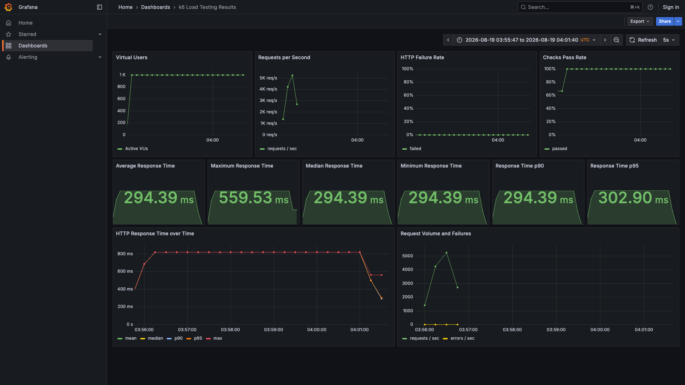
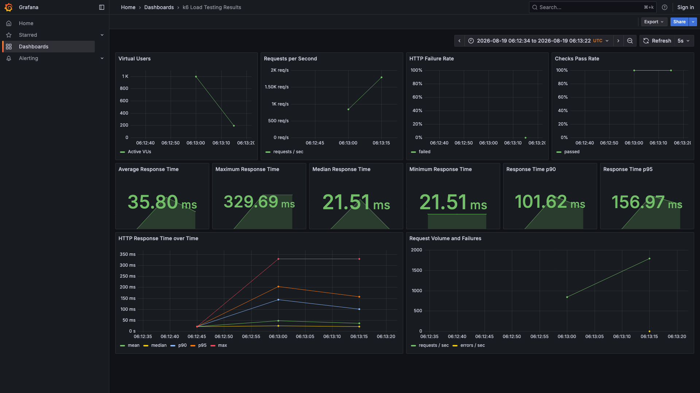
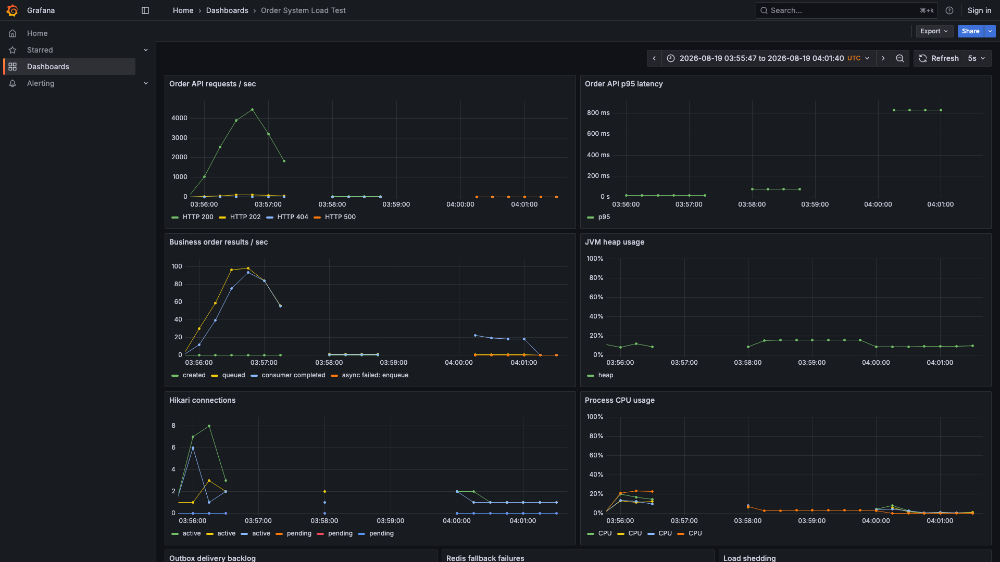
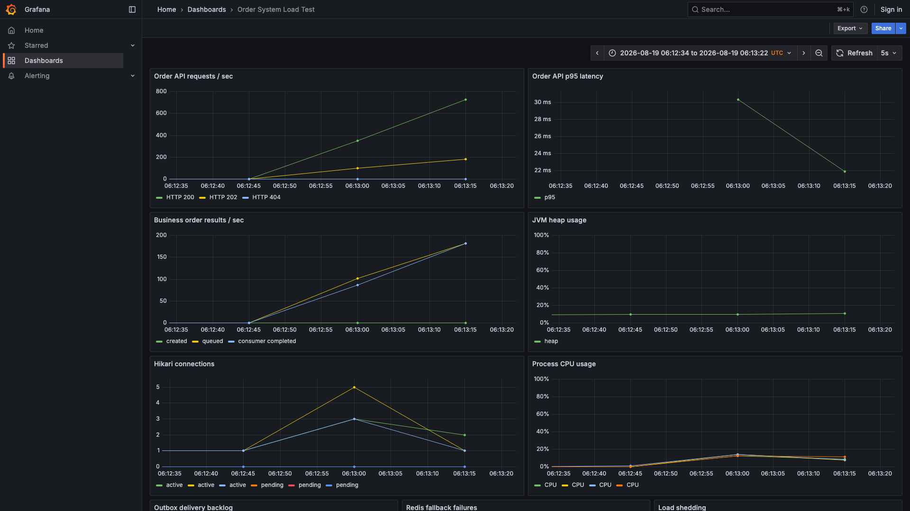

# Load-test results

## Test scope

Both runs used the same local Docker Compose environment and the same workload:

- 1 API Gateway
- 3 Spring Boot application replicas
- 6 Kafka partitions and 2 consumers per replica
- 1,000 concurrent k6 virtual users
- 10,000 full order flows: async submission, status polling, and simulated payment
- Redis, Kafka, MySQL, Prometheus, and Grafana running on the same local machine

These figures describe this machine and configuration. They are reproducible local measurements, not a claim of universal production capacity.

## Result comparison

| Metric | Before | After |
|---|---:|---:|
| Test completion time | 4m 36.7s | 27.8s |
| Submitted flows | 10,000 | 10,000 |
| Completed during test | 9,559 | 9,998 |
| Completion rate | 95.59% | 99.98% |
| Overall HTTP p95 | 173.45 ms | 98.24 ms |
| Submit p95 | 319.36 ms | 156.96 ms |
| Queue p95 | 3m 48s | 4.16s |
| HTTP request rate | 1,111.54 req/s | 1,798.92 req/s |
| HTTP failure rate | 0.15% | 0.04% |
| Prometheus series | More than 100,000 | Bounded by fixed request names |

The before run overloaded Prometheus and local Docker DNS after dynamic request IDs were used as metric labels. It also sent all orders for one product to one Kafka partition and polled every 100 ms. The run was allowed to finish far enough to preserve the failure pattern, but its monitoring stream became incomplete after Prometheus stopped.

The after run changed three pressure points:

1. Kafka uses `requestId` as the message key, distributing commands across all six partitions instead of serializing one product through one partition.
2. Polling starts at 500 ms and gradually backs off to a maximum interval of 2 seconds, reducing read amplification while keeping the UI responsive.
3. k6 assigns fixed names to dynamic status and payment URLs, preventing request IDs and order IDs from creating unbounded Prometheus time series.

The after run submitted all 10,000 flows. A total of 9,998 completed payment during the 27.8-second test window. Two reservations did not complete payment and were automatically marked `EXPIRED` after five minutes; the expiry job returned their stock. The acceptance threshold is therefore 99.9%, while the exact observed value remains recorded as 99.98%.

## Grafana screenshots

| Dashboard | Before | After |
|---|---|---|
| k6 client-side metrics |  |  |
| Server and infrastructure metrics |  |  |

The k6 dashboard answers how much load was generated and what users observed. The server dashboard explains what happened inside the three application replicas: request status, async queue/consumer progress, p95 latency, JVM heap, Hikari connections, CPU, outbox backlog, Redis fallback, and load shedding.

## Pass criteria

The current script enforces:

- check pass rate above 99%
- HTTP failure rate below 1%
- submit p95 below 2 seconds
- queue p95 below 30 seconds
- at least 99.9% of submitted orders completed during the test window

Orders that do not complete payment are not silently discarded. They remain traceable by request ID and order ID, expire after five minutes, and restore stock through the compensation path.
